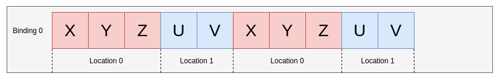
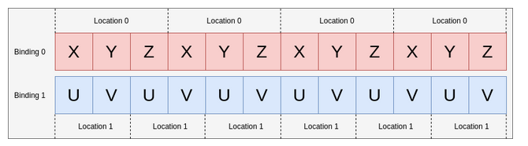

# Vulkan notes

## Vertex Buffer bindings and locations (input attributes)

The binding is the identifier of a buffer.
The location is the identifier of a vertex attribute.

We can have various vertex attributes combined and repeated in a single buffer.


We can have various attributes each in a diferent buffer (binding)


> [!NOTE] Bindings and locations are independent of each other.

So when creating a pipeline we need to describe the bindings and the (attributes/locations).

In a pipeline can't exist two attributes with the same location.

Each Binding has:

- binding (a number to be identified)
- stride (bytes between elements)
- inputRate

Each attribute has:

- binding (witch buffer is readed from)
- location (how to identifit)
- format (witch data type it is)
- offset (the offset inside one element of the binding)

[source](https://docs.vulkan.org/guide/latest/vertex_input_data_processing.html)

## Descriptors and Sets of Descriptors

Descriptors are like pointers to memory that the shader can use.
Descriptor sets are sets of descriptors. In the command buffer only descriptor sets
can be bound.

Inside a descriptor set each descriptor has a binding (identifier like in input attributes). We can have also descriptor arrays, in other words, in one binding various descriptors of the same type forming an array.

They would be accessed like this:

```glsl
layout(set = 0, binding = 0) uniform UBO0 {
    uint data;
} buffers[4];
```
