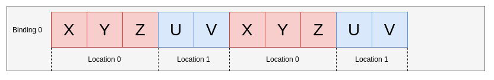
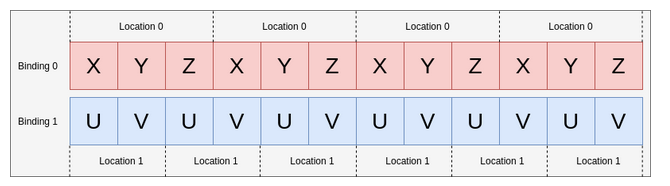

# Vulkan notes

## Vertex Buffer bindings and locations (input attributes)

The binding is the identifier of a buffer. The location is the identifier of a
vertex attribute.

We can have various vertex attributes combined and repeated in a single buffer.


We can have various attributes each in a diferent buffer (binding)


> [!NOTE] Bindings and locations are independent of each other.

So when creating a pipeline we need to describe the bindings and the
(attributes/locations).

In a pipeline can't exist two attributes with the same location.

Each Binding has:

- binding (a number to be identified)
- stride (bytes between elements)
- inputRate

Each attribute has:

- binding (witch buffer is readed from)
- location (how to identifit)
- format (witch data type it is)
- offset (the offset inside one element of the binding)

[source](https://docs.vulkan.org/guide/latest/vertex_input_data_processing.html)

## Descriptors and Sets of Descriptors

Descriptors are like pointers to memory that the shader can use. Descriptor sets
are sets of descriptors. In the command buffer only descriptor sets can be
bound.

Inside a descriptor set each descriptor has a binding (identifier like in input
attributes). We can have also descriptor arrays, in other words, in one binding
various descriptors of the same type forming an array.

They would be accessed like this:

```glsl
layout(set = 0, binding = 0) uniform UBO0 {
    uint data;
} buffers[4];
```

## Stl vector how to hide parts

First i tried inheriting but when i try to convert a vector& to its
vector_child& it gives undefined behavior... So the best way seems to be
composition or give up in protecting attrib vectors.

## Lights Lights Lights

My current plan for lights is...? SSBO

### Spot Lights

1. Lights resource in the scene
   - direction
   - fov
   - color
   - intensity
2. In the initialization create the descriptor
   and the buffer -> thats all will be filled afterwards

3. Every Frame
   - fill the SSBO with the lights info
   - so 3 buffers for now


## Notes on shadow maps

Steps to follow:
1. Create separate Images, ImageViews, Framebuffers, Renderpass
   This is because we will have only 1 stencil attachment with 1 sample
   The dependencies of the subpass should be between external and the pass and between the pass and external.
   This will allow for us to render the two passes with the same command buffer avoiding the drawing render pass to 
   execute before the depth rendre pass has finished.
2. Set the shadow depth image view as input texture (descriptor binding)  in the 
   scene drawing graphics pipeline.
3. Record the command buffer first the drawing of the shadow render pass and then the drawing of the secene.
