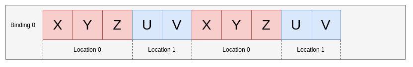
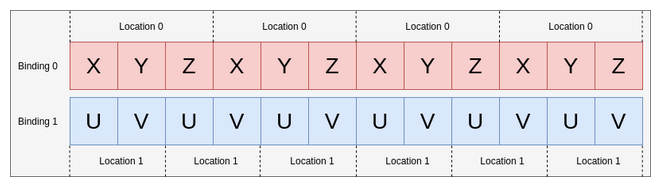

# Notes

## Vulkan API Usage

### Dependencies between Vulkan Objects

- when geo is modified only command buffer is needed to change, the pipeline
  remains.
- pipeline changes (needed to rebuild) when we change de rendering proces
  (shaders, passes...)
- swapchin needs to be rebuild when window/render target changes (size,
  aspect...)

## Hard Rules

### GPU Objects

Vulkan objects have wrpper structs and utility functions, they don't have
methods. GPU Objects are manually created and destroyed with functions.

## Shader Interface

### Vertex Buffer bindings and locations (input attributes)

The binding is the identifier of a buffer. The location is the identifier of a
vertex attribute.

We can have various vertex attributes combined and repeated in a single buffer.


We can have various attributes each in a diferent buffer (binding)


::: note Bindings and locations are independent of each other. :::

So when creating a pipeline we need to describe the bindings and the
(attributes/locations).

In a pipeline can't exist two attributes with the same location.

Each Binding has:

- binding (a number to be identified)
- stride (bytes between elements)
- inputRate

Each attribute has:

- binding (witch buffer is readed from)
- location (how to identifit)
- format (witch data type it is)
- offset (the offset inside one element of the binding)

[source](https://docs.vulkan.org/guide/latest/vertex_input_data_processing.html)

### Descriptors and Sets of Descriptors

Descriptors are like pointers to memory that the shader can use. Descriptor sets
are sets of descriptors. In the command buffer only descriptor sets can be
bound.

Inside a descriptor set each descriptor has a binding (identifier like in input
attributes). We can have also descriptor arrays, in other words, in one binding
various descriptors of the same type forming an array.

They would be accessed like this:

```glsl
layout(set = 0, binding = 0) uniform UBO0 {
    uint data;
} buffers[4];
```

### Memory Layout std140/std430

In vulkan (1.1+) the **vector-relaxed** version is used by default.

## C++

### Stl vector how to hide parts

First i tried inheriting but when i try to convert a vector& to its
vector_child& it gives undefined behavior... So the best way seems to be
composition or give up in protecting attrib vectors.

## Renderer Design

### Lights Lights Lights

My current plan for lights is...? SSBO

#### Spot Lights

1. Lights resource in the scene
   - direction
   - fov
   - color
   - intensity
2. In the initialization create the descriptor and the buffer -> thats all will
   be filled afterwards

3. Every Frame
   - fill the SSBO with the lights info
   - so 3 buffers for now

### Notes on shadow maps

Steps to follow:

1. Create separate Images, ImageViews, Framebuffers, Renderpass This is because
   we will have only 1 stencil attachment with 1 sample The dependencies of the
   subpass should be between external and the pass and between the pass and
   external. This will allow for us to render the two passes with the same
   command buffer avoiding the drawing render pass to execute before the depth
   rendre pass has finished.
2. Set the shadow depth image view as input texture (descriptor binding) in the
   scene drawing graphics pipeline.
3. Record the command buffer first the drawing of the shadow render pass and
   then the drawing of the secene.

#### Soft shadows

I will use a PCF aproach with filter width depending on ocluder distance.

The first pattern tested is a pre-computed fibonacci spiral for the sampling and
a circle for the ocluder search. The problem with searching the ocluder in a
circle is the surface accne which gets accentuated so I will try comparing the
difference between the evaluated point and the maximum distance sample in the
circle and with the minimum. If the maximum difference + the minimum diference
is close to 0 I consider the point as not occluded. If the difference is greater
than 0 by a good amount then it will be concidered occluded (or in penumbra).
Then the pattern shuld use a increasing bias.

#### Cascading Shadow Maps

For directional lights like the sum where they should cover all the view
frustum, it is needed a better aproach to shadows than large shadow maps. The
most wide-spread technique are Cascading Shadow Maps.

The technic proposes dividing the view frustum along its length into 3 or 4
parts and then render a shadow map for each part. For the closer details to have
more resolution we want to divide the frustum in an smart way. I will try taking
the square value of the portion between [0, 1] and then scaling it to the actual
frustum length.

Given $z_n$ (near plane), $z_f$ (far plane), $F$ (fov), $o$ (observer position),
$v$ view vector and $p$ frustum sections, we can define the limit begining of
section $s_i$ as:

$$
s_i = z_n + \frac{1}{p}i(z_f - z_n)
$$

$s_i$ is how far along the view vector the section starts.

Now more interestingly we should compute the four points which delimit the
section and the center of the section to then calculate the light's projection.

At distance from the observer $d$ the width of the frustum is:

$$
w_d = sin(fov/2) * 2 * d/cos(fov/2)
$$

### File changes dependency?

Maybe a file resource manager which holds all watched files and then every frame
we pull them. Or even pass the handles and the manger pointer to the watcher and
let it tag the files as "modified" making the dependent resources update.

## Better Pools

Instead of vectors linked memory chunks for more stability and O(1) cost.

## Conventions

### Naming

```
variable_name
_private_variable_name
functionName()
TypeName
handle_variable_h
pointer_variable_p
```

### Sharing Resources

Allways think who is the owner. Resources are shared by handle or handle + raw
pointer to manager Managers are shared by raw pointers. To avoid use after free
the owner of the Manager must be owner of the object with which has a pointer to
the manager.

Owner means it overlives all its possessions and controls they destruction.
