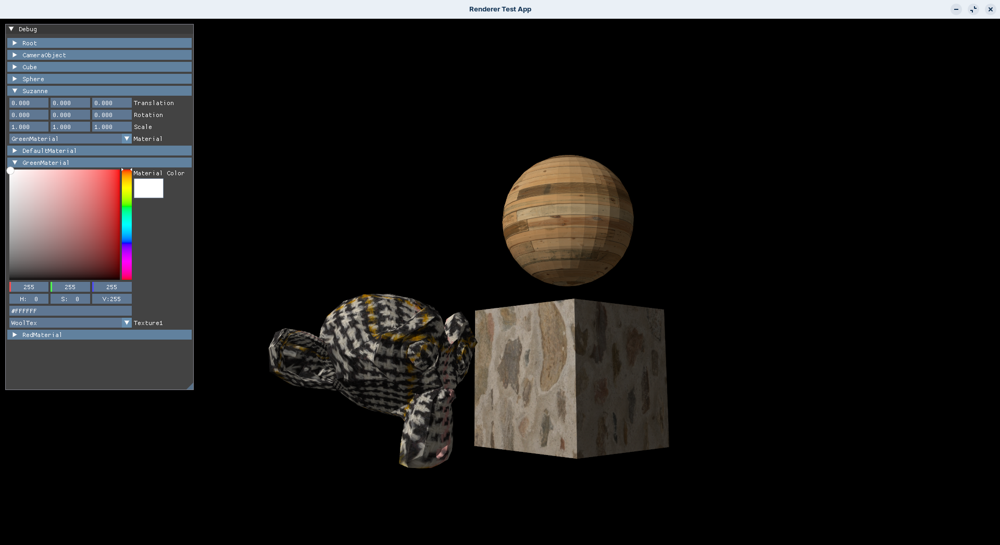

# Vulkan Renderer

## About the project

This project is _me learning vulkan_. It started as me following the Vulkan
Tutorial and has evolved into a personal project with the objective of having _a
personal graphics toolkit to play and learn_. For now is just a _work in
progress_ of a library so my main test is the file app.cpp in the tests/
directory.

## Technologies

The toolkit uses Vulkan API as graphics API and glfw for the context and input.
It uses my other library
[SceneEquipament](https://github.com/gbg4812/SceneEquipament.git) scene input to
render.

## Screenshots


## To build

### Prerequisits

- The vulkan sdk
- Network Connection

```bash
cmake -B build
cmake --build build
```

## Code Example
```cpp
int main(int argc, char* argv[]) {
    ...
    
    GLFWwindow* window = createWindow(WIDTH, HEIGHT, "Renderer Test App");
    glfwMaximizeWindow(window);
    glfwSetInputMode(window, GLFW_CURSOR, GLFW_CURSOR_DISABLED);

    gbg::RendererContext context = gbg::glfwCreateRendererContext(
        window, gbg::validationLayers, enableValidationLayers,
        gbg::deviceExtensions);

    gbg::SceneRenderer renderer(context);

    ...

    // Main Scene
    gbg::Scene sc;
    
    // Shader Creation
    auto& sh_mg = sc.getShaderManager();
    gbg::ShaderHandle shh = sh_mg.create("DefaultShader");
    gbg::Shader& sh = sh_mg.get(shh);

    sh.loadVertShaderCode("./data/shaders/vert.spv");
    sh.loadFragShaderCode("./data/shaders/frag.spv");

    // Shader Reflexion
    gbg::initShader(shh, sc);

    // Material Creation
    auto& mt_mg = sc.getMaterialManager();

    gbg::MaterialHandle mth = mt_mg.create("DefaultMaterial");
    gbg::Material& mt = mt_mg.get(mth);

    // Load Texutre
    auto& tx_mg = sc.getTextureManager();
    auto tx_h = tx_mg.create("PlankTexture");
    loadTexture("data/textures/plank_texture/raw_plank_wall_diff_1k.png", &sc,
                tx_h);  // loads texture

    // Assign shader to material
    mt.setShader(shh, sh, tx_h);

    // Other important things
    auto& st_mg = sc.getSceneTreeManager();
    auto& cm_mg = sc.getCameraManager();
    gbg::CameraHandle camh = cm_mg.create("Camera");
    gbg::SceneTreeHandle cm_nh = st_mg.create("CameraObject");

    st_mg.get(cm_nh).translation += glm::vec3{0.0f, 0.0f, 10.0f};

    st_mg.get(cm_nh).setResource(camh);
    st_mg.prependChild(sc.root, cm_nh);

    // Load model
    gbg::objLoader(arguments[1], &sc, sc.root, mth);

    // Set the active scene
    renderer.setScene(&sc);

    ...

    renderer.setActiveCamera(cm_nh);

    ...

    while (!glfwWindowShouldClose(window)) {
        glfwPollEvents();

        ...

        gbg::SceneTreeNode& cam_node = st_mg.get(cm_nh);
        glm::vec3 offset{};
        if (glfwGetKey(window, GLFW_KEY_W) == GLFW_PRESS) {
            offset.z += -2.0f * delta;
        }
        ...

        cam_node.localTranslate(offset);

        ...

        // Draw commands and updating 
        renderer.drawFrame();

        ...

    }  // end loop
    renderer.cleanup();
    
    ...
    return EXIT_SUCCESS;
}

```


## Organitzation

### Directories:

- **src/** where all the source code is.
- **src/external** repositoris of external dependencies like stb_image.
- **src/vk_utils** vulkan utility functions and structures (my be some day I will
  separate them into their own library).
