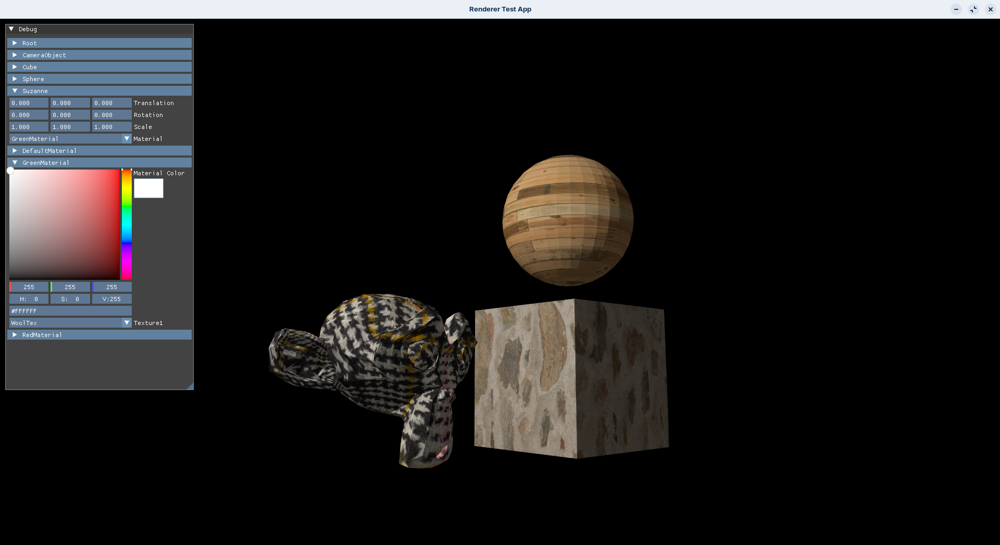

# Vulkan Renderer

## About the project

This project is _me learning vulkan_. It started as me following the Vulkan
Tutorial and has evolved into a personal project with the objective of having _a
personal graphics toolkit to play and learn_. For now is just a _work in
progress_ of a library so my main test is the file app.cpp in the tests/
directory.

## Technologies

The toolkit uses Vulkan API as graphics API and glfw for the context and input.
It uses my other library
[SceneEquipament](https://github.com/gbg4812/SceneEquipament.git) scene input to
render.

## Screenshots



## To build

### Prerequisits

- The vulkan sdk
- Network Connection

## Build Instructions

```bash
cmake -B build
cmake --build build --parallel
```

## Project Structure:

- **src/** where all the source code is.
- **src/external** repositoris of external dependencies like stb_image.
- **src/vk_utils** vulkan utility functions and structures (my be some day I will
  separate them into their own library).
- **test/** mainly the _app_ executable wich is a demo app to showcase and test the renderer.
- **Notes.md** some notes on the design and vulkan things I have learned along the path way.
